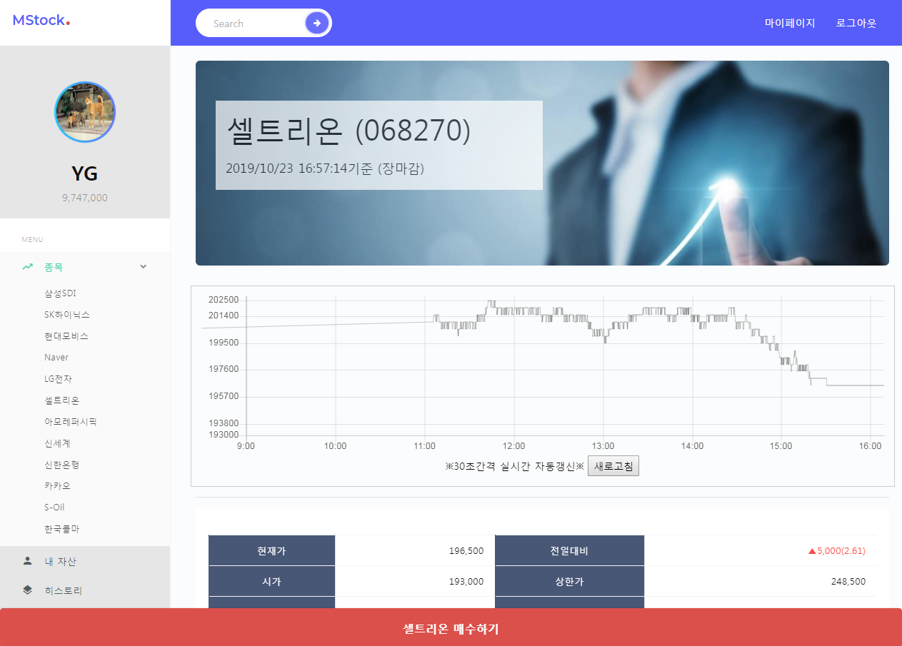

# MStock

## About the Project

- 데이터 분석과 함께하는 모의주식 플랫폼


## Features

- 실시간 주식 정보 파싱을 통한 실제 주식 환경 제공
- 종목간 매수/매도 및 자산관리 환경 제공
- 종목간 기사 스크래핑을 통한 워드클라우드, 감정분석 제공
- 10분 뒤의 현재가를 예측하는 회귀분석 제공


## Getting Started

### Architecture

- Client
  - HTML5, CSS3, JavaScript, jQuery, Ajax
  - Bootstrap4
  - Chart.js
- Server
  - Spring STS 3.9.9
  - Tomcat 9.0
  - MyBatis
  - JSP
  - R, Rserve
  - JSON
  - AWS
- Database
  - Oracle Database 11g
- Open API & XML
  - Naver Open API(Login)
  - 한국거래소 XML 서비스
- Development Flatform
  - Eclipse
  - Java(jdk1.8.0_211)
  - R Studio
  - Git

### Prerequisites

- configure.properties

```
#Database Info
username=temp
password=temp
dburl= jdbc:oracle:thin:@localhost:1521:XE

#Naver API Info
naver.client_id={네이버 클라이언트 아이디}
naver.client_secret={네이버 클라이언트 시크릿}
naver.callback_url={네이버 콜백 URL}

#R path
rsource.newsUpload='newsupload.R', encoding = 'UTF-8'
rsource.allAnalysis='All_Analysis.R', encoding = 'UTF-8'
```

### Installation

	1. Project [Clone]
 	2. Eclipse [Import] - [Project from Folder or Archive]
 	3. Select [Project Folder]
 	4. [Wait] for Completion and Installation
 	5. [Project Properties] - [Project Facet] - [Java 1.8]

### Usage

1. Rserve를 실행하세요
2. 데이터 분석 결과는 Rserve 실행 10분 뒤부터 생성됩니다
3. 주식 정보 파싱은 월-금, 09:00-16:00에만 실행됩니다
4. 랭킹은 월-금 16시에 갱신됩니다


## Screen Configuration

- Section 1 - 메인

  - 12개 종목

  


- Section 2 - 종목

  - 차트, 주가 정보
  - 10분 뒤 현재가 예측(회귀분석)
  - 뉴스 기반 워드클라우드, TF-IDF 기반 감정분석
  - 네이버 증시기사
  - 종목별 채팅
  - 매수

  

  

- Section 3 - 자산 관리

  - 자산 정보, 자산 비율, 등급
  - 보유 주식 정보
  - 매도

  

  